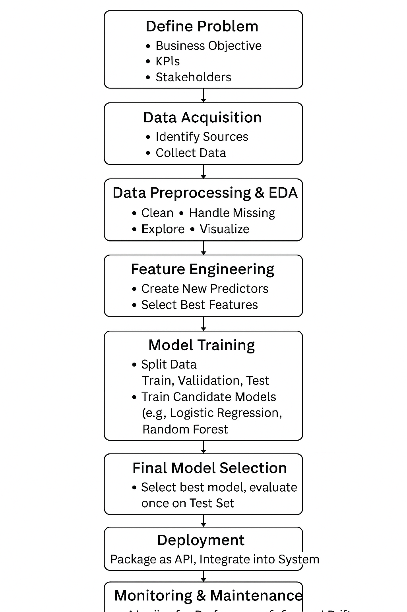

Here are the answers to the AI Development Workflow questions.

## Part 1: Short Answer Questions (30 points)

### 1. Problem Definition (6 points)

* **Hypothetical AI Problem:** Predicting employee attrition (turnover) in a large tech company.
* **3 Objectives:**
    1.  Proactively identify employees at high risk of leaving within the next 6 months.
    2.  Enable HR and managers to deliver targeted interventions (e.g., new projects, compensation review, mentorship).
    3.  Reduce overall attrition rates and associated costs (recruitment, training).
* **2 Stakeholders:**
    1.  **Human Resources (HR):** Responsible for retention strategy and implementing interventions.
    2.  **Team Managers:** Directly responsible for employee engagement and need to know who on their team is at risk.
* **1 Key Performance Indicator (KPI):**
    * **Recall (Sensitivity):** This metric measures (True Positives / (True Positives + False Negatives)). It is the most critical KPI here because the primary goal is to *find* as many of the *actual* "at-risk" employees as possible, even if it means flagging some false positives. Missing an at-risk employee (a false negative) is the worst-case scenario, as no intervention can be offered.

---

### 2. Data Collection & Preprocessing (8 points)

* **2 Data Sources:**
    1.  **Human Resource Information System (HRIS):** Contains employee demographics (age, gender), compensation history, tenure, job level, and performance review scores.
    2.  **Employee Engagement Surveys:** Contains self-reported data on job satisfaction, relationship with manager, and work-life balance (often anonymized at the team level, but sometimes attributable).
* **1 Potential Bias:**
    * **Manager-Review Bias:** Performance review scores, a key predictor, are subjective. A manager may unknowingly give lower scores to employees of a certain gender or demographic (affinity bias), or give high scores to "flight risks" to try and retain them (or low scores to push them out). The model would learn this bias and incorrectly associate those groups with attrition risk.
* **3 Preprocessing Steps:**
    1.  **Handling Missing Data:** Many employees might skip engagement surveys. These missing values would be **imputed** (e.g., using the team's average satisfaction score) or treated as a separate category ("Did Not Respond").
    2.  **One-Hot Encoding:** Convert categorical features like 'Department' (e.g., 'Sales', 'Engineering', 'Marketing') or 'Job Level' (e.g., 'L3', 'L4') into numerical columns so the model can process them.
    3.  **Feature Scaling (Standardization):** Scale numerical features like 'Salary', 'Tenure', and 'Commute Time' to have a mean of 0 and a standard deviation of 1. This prevents features with large scales (like salary) from dominating features with small scales (like performance score) in many models (e.g., SVMs, Logistic Regression).

---

### 3. Model Development (8 points)

* **Model Choice & Justification:**
    * **Model:** **Random Forest**.
    * **Justification:** This problem involves tabular data with a mix of numerical (salary) and categorical (department) features, and likely complex, non-linear relationships. A Random Forest is robust to overfitting (compared to a single decision tree), handles mixed data types well, and—most importantly—provides **feature importance**. This interpretability allows HR to understand *why* the model flagged someone (e.g., "low compensation" and "high commute time" were the top factors).
* **Data Split:**
    * **Training Set (70%):** The largest portion of the data, used to teach the model the underlying patterns associated with attrition.
    * **Validation Set (15%):** Used during development to tune hyperparameters. The model's performance on this set guides adjustments (e.g., changing the model's complexity) to prevent overfitting.
    * **Test Set (15%):** Held back and used *only once* at the very end to get an unbiased, final assessment of how the model will perform on new, unseen employees.
* **2 Hyperparameters to Tune:**
    1.  **`n_estimators` (Number of Trees):** This is the number of decision trees in the "forest." Tuning this (e.g., 100, 300, 500) is a trade-off. Too few trees may lead to underfitting, while too many add computational cost without significant performance gains.
    2.  **`max_depth` (Max Depth of each Tree):** This controls the complexity of each individual tree. An unconstrained depth (e.g., `None`) can lead to **overfitting**, where the trees memorize the training data. Tuning this (e.g., 5, 10, 15) limits the depth, forcing the model to learn more generalizable patterns.

---

### 4. Evaluation & Deployment (8 points)

* **2 Evaluation Metrics:**
    1.  **Recall:** (TP / (TP + FN)). As mentioned in Q1, this is essential. We *must* find the employees who are *actually* at risk. A low recall means the system is failing its primary purpose.
    2.  **Precision:** (TP / (TP + FP)). This is also important for resource management. If precision is too low, the model flags many employees who are *not* at risk (false positives), wasting managers' and HR's time and resources on unnecessary interventions.
* **Concept Drift:**
    * **Definition:** Concept drift is when the statistical properties of the data (or the relationship between inputs and the output) change over time, causing a deployed model's performance to degrade because its learned patterns are no longer relevant.
    * **Example:** A new company-wide "work from home" policy would make 'Commute Time' a useless predictor, causing **concept drift**.
    * **Monitoring:** Monitor the model's **Recall** on new data (e.g., employees who quit in the last month). If Recall drops below a set threshold (e.g., 70%), trigger an alert. Also, monitor the **statistical distribution** of key input features (e.g., 'average salary', 'satisfaction scores'). If these shift significantly from the training data, it signals a drift and the model likely needs to be retrained on new data.
* **1 Technical Deployment Challenge:**
    * **Data Integration & Pipelining:** The model needs fresh data from multiple, often siloed, systems (HRIS, survey tools, badge-swipe logs). Building a reliable, automated **data pipeline** that can extract, transform, and load (ETL) this data on a regular schedule (e.g., weekly) to feed the model for new predictions is a significant engineering challenge.

## Part 2: Case Study Application (40 points)

### Problem Scope (5 points)

* **Problem:** To predict the risk (high, medium, low) of a patient being readmitted to the hospital within 30 days of discharge.
* **Objectives:**
    1.  Accurately identify high-risk patients *before* they are discharged.
    2.  Enable care managers to allocate limited post-discharge resources (e.g., follow-up calls, home nurse visits) to the patients who need them most.
    3.  Improve patient outcomes and reduce hospital penalties associated with high 30-day readmission rates.
* **Stakeholders:**
    1.  **Patients:** Receive better, more targeted follow-up care, reducing their chance of a costly and difficult readmission.
    2.  **Clinical Staff (Doctors, Nurses, Care Managers):** Use the risk score as a clinical decision-support tool to prioritize discharge planning.
    3.  **Hospital Administration:** Aims to lower costs, reduce readmission penalties (from insurers/government), and improve overall quality-of-care metrics.

---

### Data Strategy (10 points)

* **Data Sources:**
    1.  **Electronic Health Records (EHRs):** Primary diagnoses (ICD-10 codes), comorbidities, procedures performed, length of stay, vital signs at discharge, and lab results.
    2.  **Patient Demographics:** Age, gender, zip code (as a proxy for socioeconomic factors).
    3.  **Admission/Discharge/Transfer (ADT) Data:** History of prior admissions (e.g., number of admissions in the last 6 months).
    4.  **Medication Records:** Discharge medication list (e.g., number of new prescriptions, high-risk medications like opioids or anticoagulants).
* **2 Ethical Concerns:**
    1.  **Patient Privacy (HIPAA):** The model requires access to highly sensitive Protected Health Information (PHI). All data must be de-identified or pseudonymized during development, and the final deployed system must be on a secure, HIPAA-compliant server with strict, auditable access controls.
    2.  **Algorithmic Bias:** The model could learn historical biases. For example, if patients from low-income zip codes were historically less likely to have access to follow-up care, their data might show fewer readmissions (as they went to other hospitals or didn't seek care). The model might incorrectly learn "low-income zip code = low risk," thus denying them the very post-discharge resources they need.
* **Preprocessing Pipeline:**
    1.  **Ingestion:** Join data from EHR, ADT, and demographic tables using a secure patient identifier.
    2.  **Feature Engineering:**
        * Count the number of prior admissions in the last 6 and 12 months.
        * Calculate a **Comorbidity Index** (e.g., Charlson score) based on the list of ICD-10 diagnosis codes.
        * Count the total number of discharge medications.
        * Bin categorical features (e.g., group the 10,000+ ICD-10 codes into ~280 clinical groups using the CCS classification system).
    3.  **Encoding:** One-hot encode categorical features like 'Discharge Disposition' (e.g., 'Home', 'Skilled Nursing Facility').
    4.  **Imputation:** Handle missing lab values using median imputation or a "missing" indicator flag.
    5.  **Scaling:** Standardize numerical features like 'Age' and 'Length of Stay'.

---

### Model Development (10 points)

* **Model Selection & Justification:**
    * **Model:** **Logistic Regression** (with L2 Regularization).
    * **Justification:** While models like XGBoost might be slightly more accurate, **interpretability is critical** in healthcare. A doctor will not trust a "black box" prediction. A Logistic Regression model is highly interpretable; its coefficients directly show which factors (e.g., `prior_admissions`, `diabetes_comorbidity`) contributed most to the risk score. This transparency builds clinical trust and allows for actionable insights. It is also computationally cheap and fast to run.
* **Confusion Matrix & Metrics (Hypothetical Data):**
    * *Scenario:* A model is tested on 200 discharged patients. In reality, 30 of them *were* readmitted (Positive Class), and 170 *were not* (Negative Class).

| | Predicted: Readmit | Predicted: No Readmit |
| :--- | :---: | :---: |
| **Actual: Readmit** | **25** (TP) | **5** (FN) |
| **Actual: No Readmit** | **15** (FP) | **155** (TN) |

* **Calculations:**
    * **Precision** = TP / (TP + FP) = 25 / (25 + 15) = 25 / 40 = **62.5%**
        * *Interpretation:* When the model predicts a patient is "high risk," it is correct 62.5% of the time.
    * **Recall** = TP / (TP + FN) = 25 / (25 + 5) = 25 / 30 = **83.3%**
        * *Interpretation:* The model successfully identified 83.3% of all patients who were *actually* readmitted (this is a strong, desirable result).

---

### Deployment (10 points)

* **Integration Steps:**
    1.  **Package Model as API:** The trained model and preprocessing pipeline are containerized (e.g., using Docker) and exposed as a secure REST API (e.g., using FastAPI) that accepts a patient's data (at discharge) and returns a JSON response with a risk score (e.g., `{"risk_score": 0.85, "risk_level": "High"}`).
    2.  **Deploy on Compliant Infrastructure:** This API is deployed on a HIPAA-compliant server (e.g., a private cloud or a secured on-premise server) with all data transfer encrypted (HTTPS).
    3.  **EHR Integration:** The hospital's IT team integrates this API into the Electronic Health Record (EHR) system. When a clinician opens the discharge workflow for a patient, the EHR automatically sends the required data to the API and displays the returned risk score ("High Risk") directly on the screen as a "Clinical Decision Support" alert.
* **Ensuring HIPAA Compliance:**
    * **Data Minimization:** The API is designed to receive *only* the minimum necessary data to make a prediction, not the patient's entire medical history.
    * **Access Control & Auditing:** Only authenticated and authorized users (e.g., doctors, care managers) can trigger the model or see its output. All API calls are logged in an audit trail (who, what, when).
    * **Encryption:** All data is encrypted **in transit** (using HTTPS/SSL) between the EHR and the model API, and **at rest** (if any data is cached or logged).
    * **Business Associate Agreement (BAA):** If using a cloud provider (e.g., AWS, Azure), a BAA must be in place, as the provider is a "Business Associate" handling PHI.

---

### Optimization (5 points)

* **1 Method to Address Overfitting:**
    * **L2 Regularization (Ridge):** This is the best method for the chosen Logistic Regression model. It adds a "penalty" to the model's loss function based on the *squared magnitude* of the model coefficients. This discourages the model from assigning excessively large weights to any single feature. It "shrinks" the coefficients, forcing the model to rely on a broader set of features and preventing it from memorizing noise in the training data, thus improving its ability to generalize to new patients.

## Part 3: Critical Thinking (20 points)

### Ethics & Bias (10 points)

* **How Biased Data Affects Outcomes:**
    * If historical data shows that patients from a specific racial group or socioeconomic status (e.g., identified by zip code) were less likely to receive follow-up appointments, their readmissions might be under-recorded (they went to a different hospital or didn't seek care). The AI model, trained on this biased "ground truth," will learn that "Patients from Group X = Low Readmission Risk."
    * **Effect:** This creates a harmful feedback loop. The AI will assign low risk scores to this already underserved group, making them *ineligible* for the new post-discharge intervention programs. The model **algorithmically perpetuates and amplifies** the existing health inequity, denying critical resources to the very patients who may need them most.
* **1 Mitigation Strategy:**
    * **Audit and Re-weighting:** After training, **audit** the model's performance (specifically the False Negative Rate) across different demographic subgroups (race, gender, socioeconomic status). If the model is found to be "missing" high-risk patients from a specific group at a higher rate, one mitigation strategy is **re-weighting**. This involves retraining the model but giving a higher *weight* to the training samples from the underserved group, forcing the model to pay more attention to them and learn their patterns correctly, thereby equalizing the error rates across groups.

---

### Trade-offs (10 points)

* **Interpretability vs. Accuracy in Healthcare:**
    * This is the central trade-off in clinical AI. A highly complex "black box" model (like a Deep Neural Network or large XGBoost) might achieve **90% accuracy** by finding subtle, non-linear patterns in the data. However, if a doctor cannot understand *why* the model flagged a patient as high-risk, they will not trust it. They may ignore the recommendation, rendering the model useless.
    * A simple "glass box" model (like **Logistic Regression**) might only achieve **85% accuracy**. However, it provides full **interpretability**. The doctor can see *exactly* which factors (e.g., `prior_admissions = 3`, `has_diabetes = 1`) led to the high-risk score. This builds trust, allows the doctor to use their own clinical judgment to validate the finding, and makes the model an effective *assistant* rather than a mysterious black box.
    * **Conclusion:** In healthcare, a slight sacrifice in raw accuracy is often (but not always) an acceptable trade-off to gain the **trust, adoption, and safety** that comes from interpretability.
* **Impact of Limited Computational Resources:**
    * If the hospital has limited resources (e.g., standard on-premise servers, no GPUs), this severely restricts model choice.
    * **Impact:** Training large, complex models like **Deep Neural Networks** or even large **Random Forests** would be computationally infeasible; it would take days or weeks. Furthermore, these heavy models would have high **inference latency**, meaning the prediction might take 10-20 seconds to return. This is too slow for a clinical workflow where a doctor is waiting for the discharge screen to load.
    * **Model Choice:** The hospital would be forced to use computationally "light" and efficient models. This strongly favors models like **Logistic Regression**, **Naive Bayes**, or **Support Vector Machines (SVMs) with a linear kernel**. These models train quickly on CPUs and provide near-instantaneous (low-latency) predictions, making them perfect for deployment on modest hardware.

## Part 4: Reflection & Workflow Diagram (10 points)

### Reflection (5 points)

* **Most Challenging Part:** The **Data Collection & Preprocessing** stage, specifically anticipating the ethical implications and data biases (like in the case study). It's relatively straightforward to train a model, but the *real* challenge is ensuring the data is a fair and accurate representation of reality. Realizing that the "ground truth" data (like readmission records) is itself a product of a biased system (e.g., unequal access to care) is the most difficult part. If you get this step wrong, the most accurate model in the world will simply be "accurately" perpetuating an existing injustice.
* **How to Improve:** With more time and resources, my first step would be **deep collaboration with Subject Matter Experts (SMEs)**. I would spend time shadowing care managers and doctors to understand *which* features they use in their *human* judgment. This qualitative insight is invaluable for **feature engineering**. Secondly, I would invest heavily in a **formal bias audit**, simulating the model's impact on different protected groups *before* deployment to ensure its recommendations are equitable.

---

### Diagram (5 points)

Here is a flowchart of the end-to-end AI Development Workflow.

